

Collection of photographs. Most of them were taken by a CANON 60D during Yinda Xu's leisure time.

- NOTE 1: all photos within this page are protected by a **CC BY-NC 4.0** license. See the detail **at the bottom of this page**.
- NOTE 2: click on the photo to check out the **full resolution** version.

Bell Accompanied by the Landscape of Autumn, Beijing, China
==========================================================================================
An iron bell hanging in the foreground with a colorful landscape of autumn in the background, taken during a mountain hiking in the Xishan National Forest Park of Beijing.

[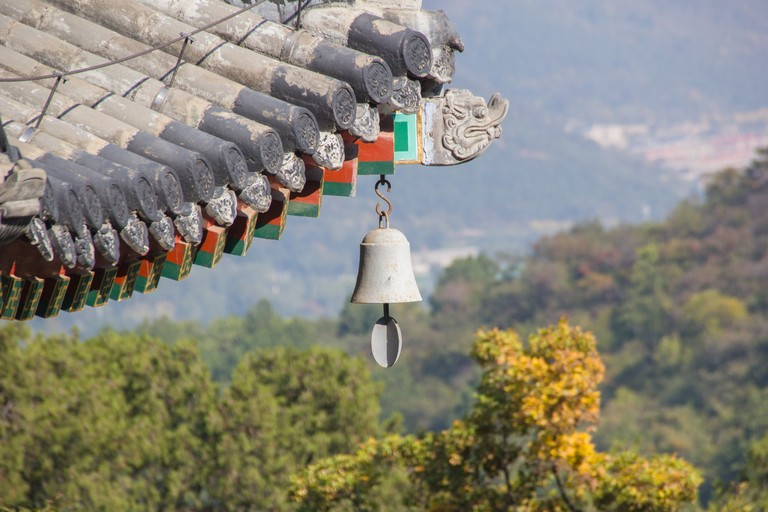](../_pages/photography/IMG_5680.jpg)

$~$

_________________

Red Leaves at Wucaiqianshan (舞彩浅山), Beijing, China
==========================================================================================
Re-feel the autumn of Beijing before entering the "nuit blanche" or "war room" phase before the CVPR submission deadline. This photo was taken five years after the former Xishan Bell photo. Glad to still be a player at the table even five years later.

[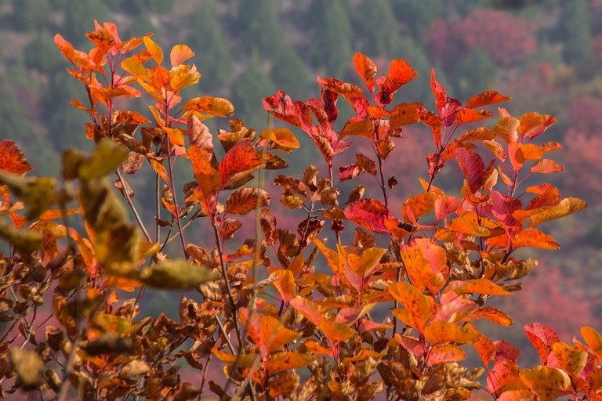](../_pages/photography/IMG_2120.jpg)

$~$

_________________

Sun Rising Taken from Zhoushan Island, Zhoushan, China
==========================================================================================

Sun rising with industrial ships crossing the light.

[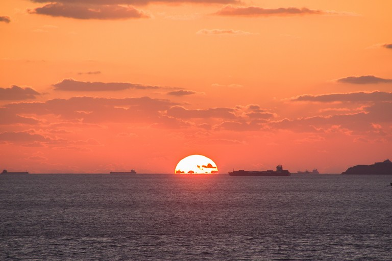](../_pages/photography/IMG_1062.jpg)

$~$

_________________

Morning at Marseille-Saint-Charles, Marseille, France
==========================================================================================
A view inside the train station, casting through the rails and extending to their extremity, where a TGV (Train à Grande Vitesse), the French high-speed train, was entering the station. Taken in the early morning, and synthesized with High Dynamic Range (HDR) technique.

DISCLAIMER: Marseille-Saint-Charles is a terminus and this photo was taken with my camera mounted on a mini tripod placed on the platform at the end of the rail.

[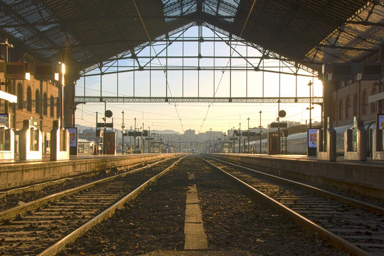](../_pages/photography/HDR_8111.jpg)

$~$

_________________

Notre-Dame de la Garde, Marseille, France
==========================================================================================
The Basilique Notre-Dame de la Garde, taken from a platform outside the train station Marseille-Saint-Charles.

[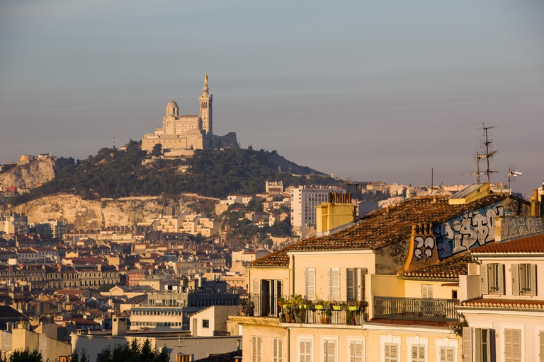](../_pages/photography/IMG_8127.jpg)

$~$

_________________

Vieux-Port, Marseille, France
==========================================================================================
Le Vieux-port (the old port) in Marseille.

[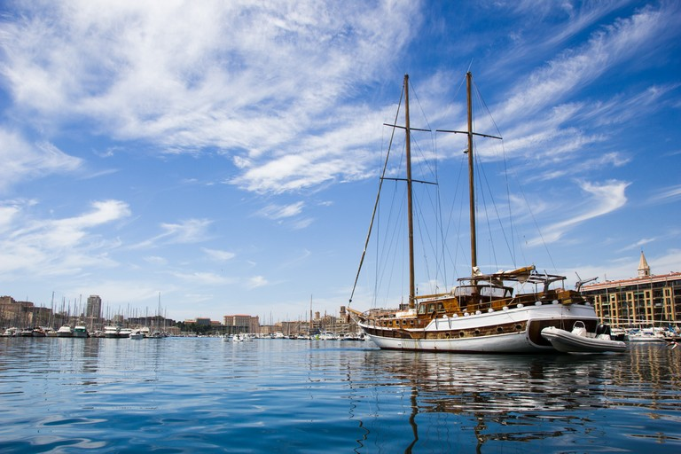](../_pages/photography/IMG_5581.jpg)

$~$

_________________

Area of Neuschwanstein Castle, Schwangau, Germany
==========================================================================================
Photo taken from a balcony of the Neuschwanstein Castle during the autumn season.

[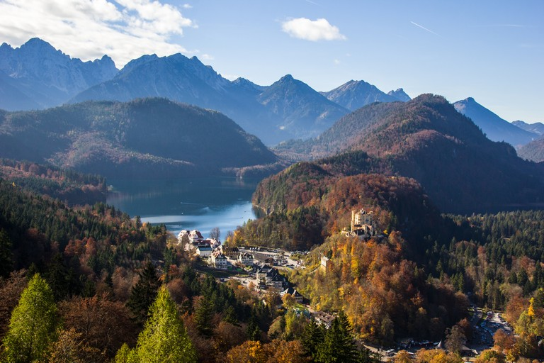](../_pages/photography/IMG_2993.jpg)

$~$

_________________

Petite France, Strasbourg, France
==========================================================================================
La Petite France in Strasbourg, with the reflection of ancient buildings.

[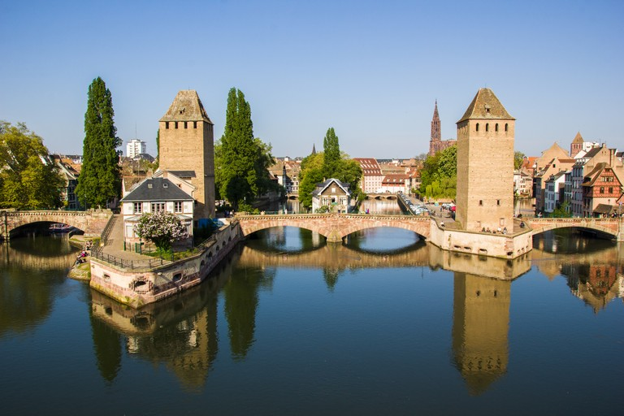](../_pages/photography/IMG_5193.jpg)

$~$

_________________

Eave of an Ancient Building, Beijing, China
==========================================================================================
The eave of a building within the Beijing Temple of Confucius

[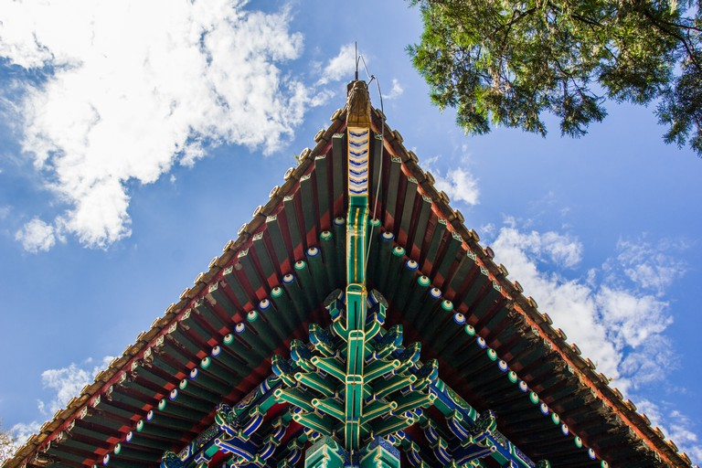](../_pages/photography/IMG_0143.jpg)

$~$

_________________

Gate Tower of Tiananmen in the Evening, Beijing, China
==========================================================================================
Gate Tower of Tiananmen with the national emblem of P. R. China centered in the middle of the image. Taken with the body leaning on a hurdle, with a tiny tripod standing against my shoulder, and with multiple times of exposures (finally one of them was clear enough).

[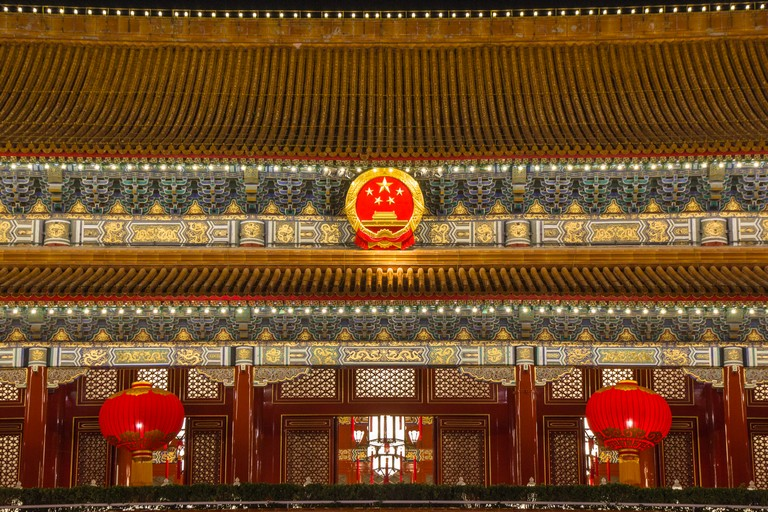](../_pages/photography/IMG_5287.jpg)

$~$

_________________

Flag Raising Ceremony on the Tiananmen Square, Beijing, China
==========================================================================================
The moment where a soldier from the Beijing Garrison Honor Guard Battalion unrolled the Five-star Red Flag. A team of officers were saluting uniformly to the flag.

The original version of this photo contains many noises due to insufficient light and fast speed of the unrolling motion. The ISO was too high otherwise the shutter speed would not be fast enough to capture the very short moment of unrolling without motion blur. Hopefully, nowdays we have a bunch of powerful and off-the-shelf AIGC tools which may help to denoise this photo. Current version was denoised with the noise filter in Photoshop©.

Reference:

- [Beijing Garrison Honor Guard Battalion](https://en.wikipedia.org/wiki/Beijing_Garrison_Honor_Guard_Battalion)
- [Photoshop Noise Filter](https://helpx.adobe.com/photoshop-elements/using/noise-filters.html)

[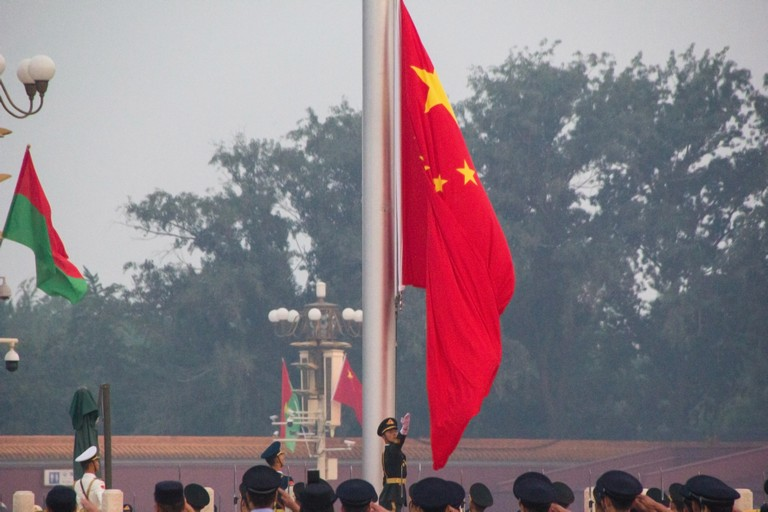](../_pages/photography/IMG_7884_denoised.jpg)

$~$

_________________

Parked KTM250Duke at the Roadside of Grass Skyline, Zhangjiakou, China
==========================================================================================

Birthday ride with my motorbike. Celebrate my 30th anniversary and head into the next decade of my life.

[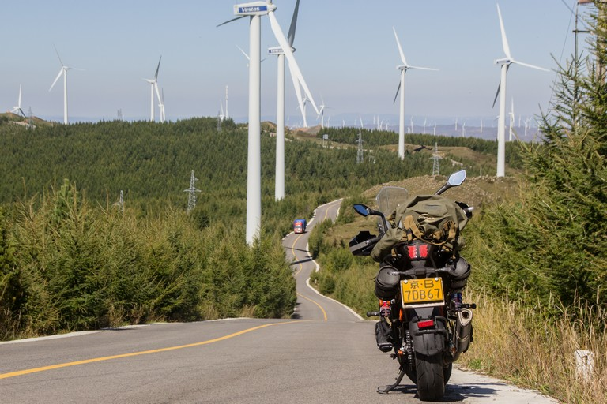](../_pages/photography/IMG_1849.jpg)

$~$

_________________

Overhead View of Yuquan Campus of Zhejiang University, Hangzhou, China
==========================================================================================
For reaching the view point, one needs to start from the library of Yuquan Campus and climb several hundreds of steps of the Laohe mountain.

[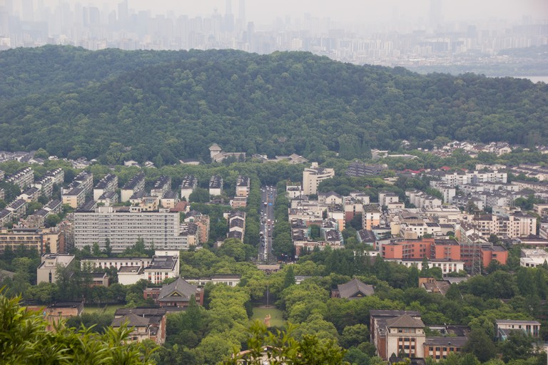](../_pages/photography/IMG_1376.jpg)

$~$

_________________

Tiny Snowman on One Railing by the West Lake, Hangzhou, China
==========================================================================================

The West Lake is located in Hangzhou which is my hometown. There is not much snow in Hangzhou. And no need to mention such an occasion where I could meet a snowman as cute as the one in this photo. Snowmen don't last for long, but as one instructor during a lecture on photography at ZJU said, "Trigger the shutter and therefore preserve the story" (original version in Chinese: "快门下去就是历史"). This should be one of the initial motivations of many photographers in my opinion.

[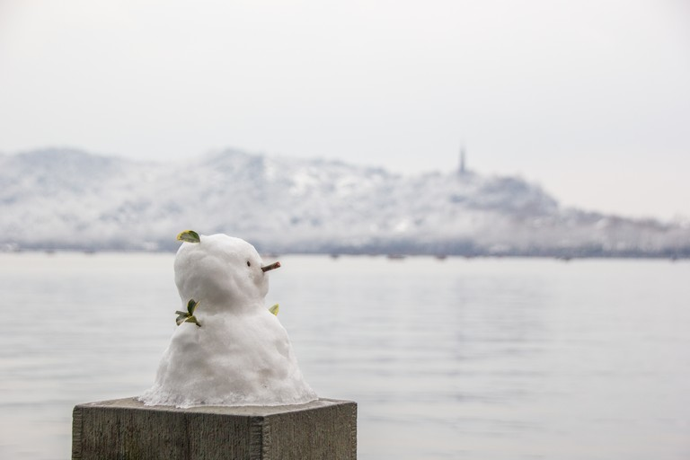](../_pages/photography/IMG_4161.jpg)

$~$

_________________

Anabranch of the Yellow River, Shanxi, China
==========================================================================================
Two vehicles is crossing on a bridge over an anabranch of the Yellow River. Taken during a motorcycle road trip along the Yellow River and crossing the Qin Mountains.

[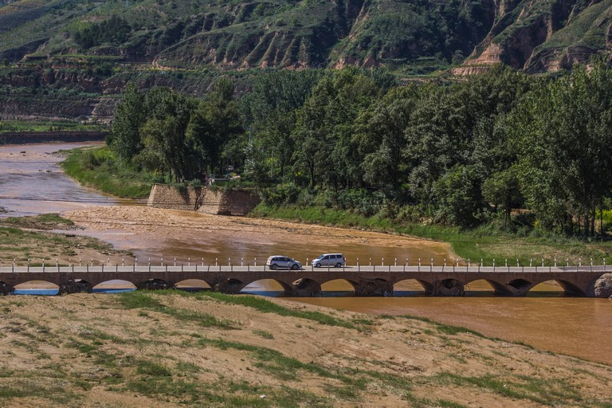](../_pages/photography/IMG_2032.jpg)

$~$

_________________

Seventeen-Arch Bridge (十七孔桥), Summer Palace (颐和园), Beijing, China
==========================================================================================
Taken on a date that is not far away from the winter solstice and therefore fortunate enough to enjoy an approached version of golden light crossing the arches (金光穿洞).

[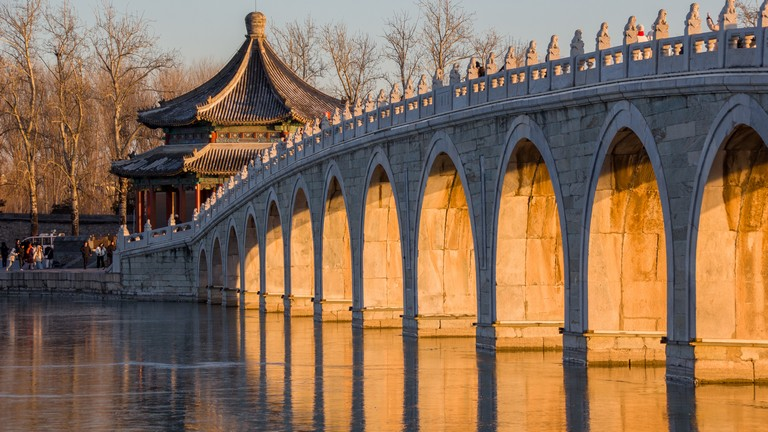](../_pages/photography/IMG_2342.jpg)

$~$

_________________

Sunrise Taken at Dongjiang (东疆), Tianjin, China
==========================================================================================
Taken during a motorcycle road trip. This scene reminds me of the opening image of [ED20 of *One Piece*](https://www.youtube.com/watch?v=1yRn2N9BwRY) as well as the first sentence of [lyrics of "Dear Sunrise"](https://onepiece.fandom.com/wiki/Dear_sunrise) by Maki Otsuki which is accompanied by a sentiment of reaching the end of a grand journey.

`どれだけ走ってきたのか、分からないまま傷跡数えた。`

It resonates with me by recalling the distance of my life path already accomplished which is paved with my past achievements. I feel like someone is telling me, "A valuable past worths continuous endeavor in the future.". `さ、諦めないよ。`

[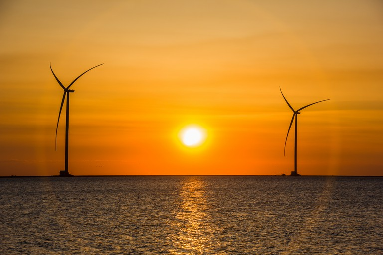](../_pages/photography/IMG_5051.jpg)

$~$

_________________

KTM250Duke Parked at the Entrance of Mulan Paddock (木兰围场), Chengde, China
==========================================================================================

Previous serving as a hunting ground during the Qing Dynasty, Mulan Paddock is now named the Saihanba (塞罕坝) National Forest Park and is connected to the eastern starting point of the National Scenic Highway No. 1 (国家一号风景大道) whose length is 180km.

Taken on the last day of my [longest multi-day road trip by motorcycle](https://www.foooooot.com/trip/8851195/) accomplished alone. This day, I drove more than 200km of [highways](https://zh.wikipedia.org/zh-cn/%E4%B8%AD%E5%8D%8E%E4%BA%BA%E6%B0%91%E5%85%B1%E5%92%8C%E5%9B%BD%E5%9B%BD%E9%81%93) and 400km of [expressways](https://zh.wikipedia.org/zh-cn/%E4%B8%AD%E5%8D%8E%E4%BA%BA%E6%B0%91%E5%85%B1%E5%92%8C%E5%9B%BD%E9%AB%98%E9%80%9F%E5%85%AC%E8%B7%AF) with my bike.

[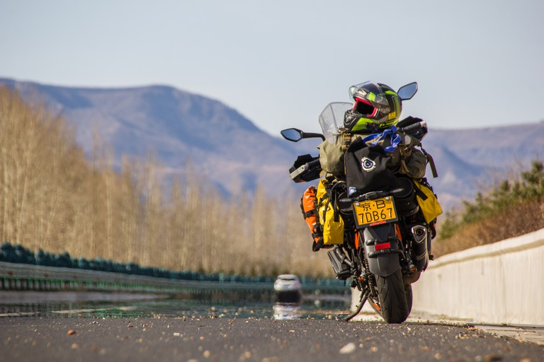](../_pages/photography/IMG_5842.jpg)

$~$

_________________

Lakeside of Qinghai Lake, Qinghai, China
==========================================================================================

View of Qinghai Lake from the ring road. I had been waiting until a vehicle passed the center between two poles. The lower part is a piece of grassland accompanied by a herd of sheep. The weather was a bit foggy which made the upper part of the lake in the photo covered of white fog. As the largest lake in China, Qinghai Lake is preserved carefully and only allows tourists to reach the lakeside of a limited number of areas.

Reference: [Qinghai Lake](https://en.wikipedia.org/wiki/Qinghai_Lake)

[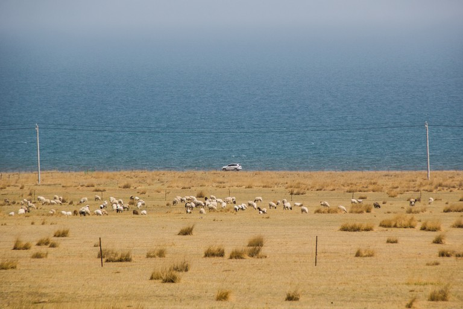](../_pages/photography/IMG_1088.jpg)

$~$

_________________

Sunrise Taken from the Peak of Mount Tai, Qinghai, China
==========================================================================================

Sunrise witnessed from Sun Viewing Peak. Deemed as the most revered one of the Five Sacred Mountains (五岳独尊), Mount Tai is famous for its grandiose landscape, rock carving with calligraphy, and more. Witnessing the sunrise on the peak after climbing Mount Tai during the night without sleep is a popular activity, especially among university students.

Reference: [Mount Tai](https://en.wikipedia.org/wiki/Mount_Tai)

[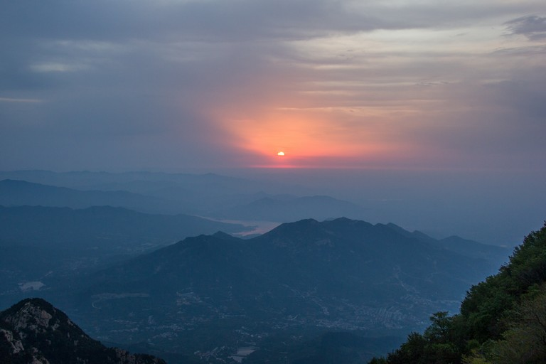](../_pages/photography/IMG_1305.jpg)

$~$

_________________

LICENSE
==========================================================================================

<a property="dct:title" rel="cc:attributionURL" href="https://marmotatzju.github.io/photography/">Yinda Xu's Collection of Photographs</a> by <a rel="cc:attributionURL dct:creator" property="cc:attributionName" href="https://marmotatzju.github.io/">Yinda (Frédéric) Xu (许胤达)</a> is licensed under <a href="http://creativecommons.org/licenses/by-nc/4.0/?ref=chooser-v1" target="_blank" rel="license noopener noreferrer" style="display:inline-block;">Attribution-NonCommercial 4.0 International</a>

Source of licensing: [CC license chooser](https://chooser-beta.creativecommons.org/)

<!-- TODO (yinda): include other selected photos -->
